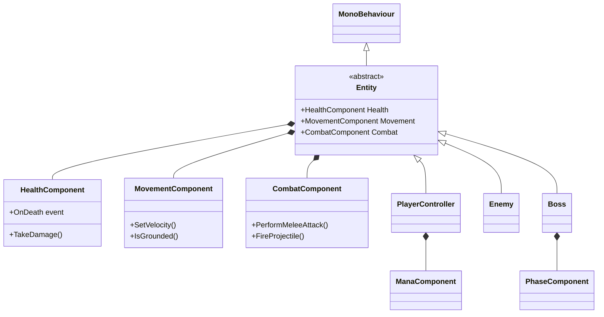

# Unity 2D Action Platformer

> 메트로배니아 스타일의 2D 액션 플랫포머 게임 클라이언트 개발 프로젝트입니다.<br>
> Unity 6 / C# 기반으로 게임 클라이언트 프로그래머의 핵심 역량(아키텍처 설계, 디자인 패턴 적용, 게임 필 구현)을 보여주기 위해 제작했습니다.

<!-- TODO: 메인 게임플레이 GIF 삽입 (10초 분량, 타이틀 → 전투 → 보스) -->
<!--  -->

## 🎮 프로젝트 개요

| 항목 | 내용 |
|------|------|
| **개발 기간** | 2026.03 ~ 2026.04 (약 1개월) |
| **개발 인원** | 1인 (개인 프로젝트) |
| **장르** | 2D 액션 플랫포머 |
| **엔진 / 언어** | Unity 6 / C# |
| **주요 패키지** | Cinemachine, Input System, URP, TextMesh Pro |

## ✨ 핵심 기능

- **컴포넌트 기반 Entity 시스템** — Health, Movement, Combat, Mana 등 단일 책임 컴포넌트로 분리
- **제네릭 유한 상태 머신(FSM)** — Player / Enemy / Boss가 동일한 인프라 공유
- **이벤트 중계 아키텍처** — GameManager 기반 Mediator 패턴으로 결합도 최소화
- **Strategy 패턴 기반 적 시스템** — 새 적 종류 추가 시 기존 코드 수정 없이 SO 자산만 생성
- **보스 페이즈 시스템** — 체력 임계점 기반 데이터 스왑
- **JSON 영구 저장 시스템** — 체크포인트 / 씬 전환 자동 저장
- **게임 필 구현** — 입력 버퍼링, 코요테 타임, 가변 점프, 히트스톱, 카메라 셰이크

## 🎬 시연 영상

<!-- TODO: 유튜브 영상 업로드 후 링크 교체 -->
[▶ 게임플레이 영상 보기](https://youtu.be/PLACEHOLDER)

## 📚 상세 포트폴리오

기술적 의사결정과 트러블슈팅 과정은 노션 포트폴리오에서 자세히 확인하실 수 있습니다.

<!-- TODO: 노션 포트폴리오 공개 링크 삽입 -->
👉 **[노션 포트폴리오 바로가기](https://cookie-lock-dbc.notion.site/Unity-2D-34e87bfb3960805ea2b6e504c4e6c4de?source=copy_link)**

## 🏗️ 시스템 아키텍처



> Boss는 의도적으로 Enemy를 상속받지 않고 Entity의 형제 클래스로 두었습니다.<br>
> Enemy의 순찰/후퇴/감지 등은 Boss에게 의미가 없는 더미 코드가 되기 때문입니다 (LSP 원칙).

## 📁 프로젝트 구조

```
Assets/Scripts/
├── Core/              # 매니저 클래스 (Game, UI, Audio, Data, Scene 등)
│   └── Define.cs      # 모든 상수의 단일 진실 공급원
├── EntityBase/        # 모든 캐릭터의 베이스 (Entity, Components, FSM)
├── Player/            # 플레이어 컨트롤러 + 상태 머신
├── Enemies/           # 적 클래스 + Strategy 패턴 기반 데이터
├── Boss/              # 보스 클래스 + 페이즈 시스템
├── Combat/            # 투사체, 데미지 처리
├── Camera/            # Cinemachine 카메라 설정
├── Environment/       # 포탈, 체크포인트, 함정
└── UI/                # HP/MP 바, 메뉴 시스템
```

## 🛠️ 적용한 디자인 패턴

- **Mediator** — `GameManager`가 Player / Enemy / UI 사이를 중재
- **Observer** — 컴포넌트 간 통신을 이벤트 기반으로 분리
- **Strategy** — `EnemyData`가 자신의 공격 행동을 직접 생성 (OCP 원칙)
- **State** — 제네릭 FSM으로 모든 캐릭터의 행동 분리
- **Object Pool** — 투사체 재사용으로 GC 부담 경감
- **Singleton** — 매니저 클래스 (DontDestroyOnLoad)

## 👤 개발자

<!-- TODO: 본인 정보로 교체 -->
- **이름**: 이정민
- **이메일**: dlwjdals102@naver.com
- **포지션**: 게임 클라이언트 프로그래머 (신입)

## 📜 사용된 에셋 (Asset Credits)

본 프로젝트는 다음 무료 에셋을 사용했습니다. 모든 에셋은 라이센스에 따라 적법하게 사용되었습니다.

### Graphics
<!-- TODO: 실제로 사용한 에셋만 남기고 나머지는 삭제 -->
- **Mossy Cavern** by Maaot — [itch.io](https://maaot.itch.io/mossy-cavern)
- **2D DarkCave Assets** by Maaot — [itch.io](https://maaot.itch.io/2d-browncave-assets)
- **Boss: Undead Executioner** by Kronovi — itch.io

### Tools
- Unity 6 (Unity Technologies)
- Cinemachine, Input System, Universal Render Pipeline (Unity Package)

---

> 본 프로젝트는 포트폴리오 목적으로 제작되었으며, 사용된 에셋의 저작권은 원작자에게 있습니다.
